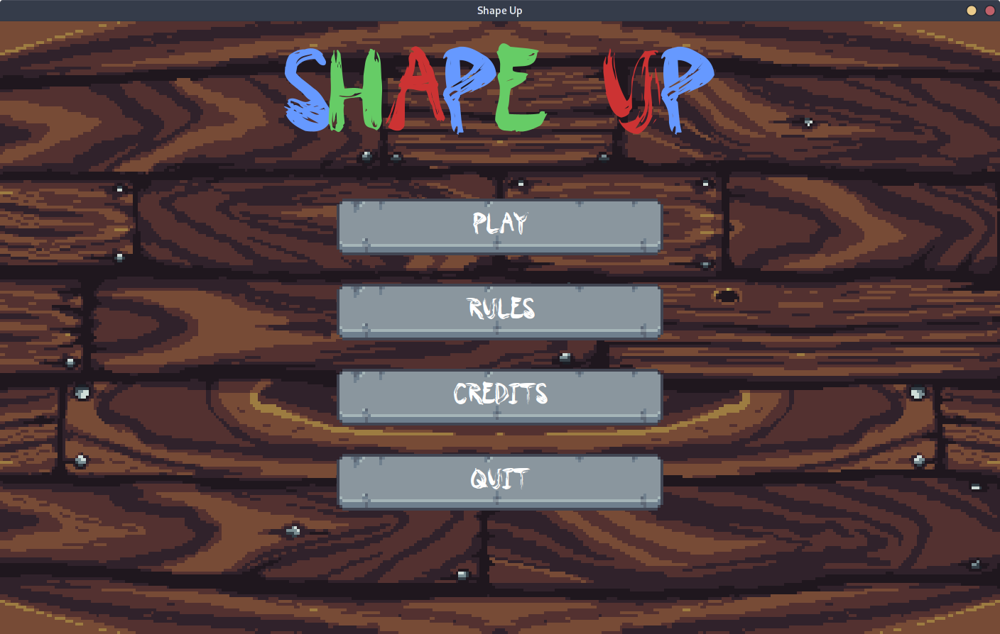
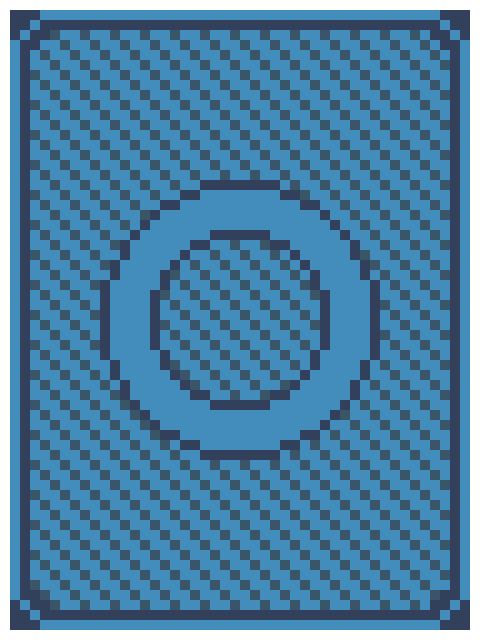
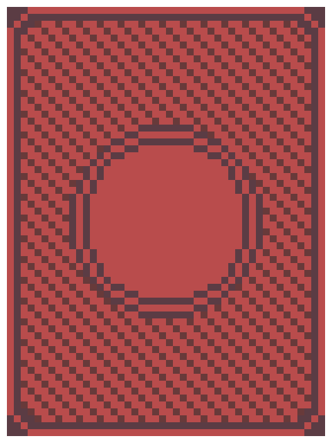
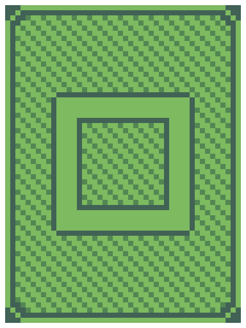
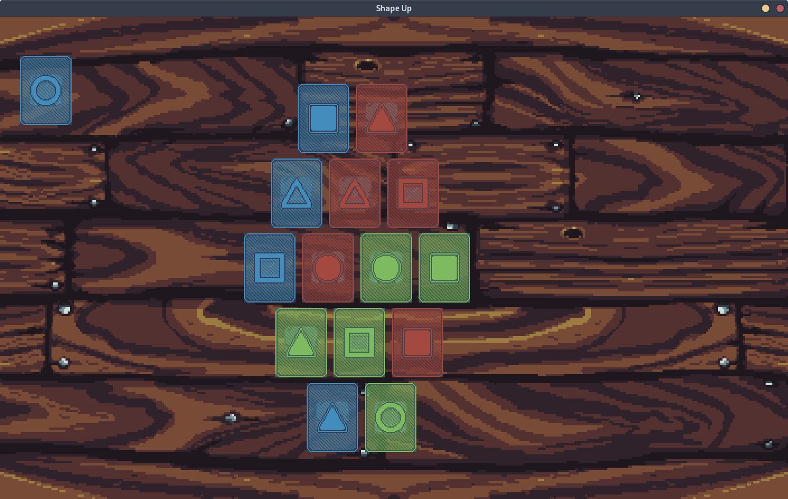
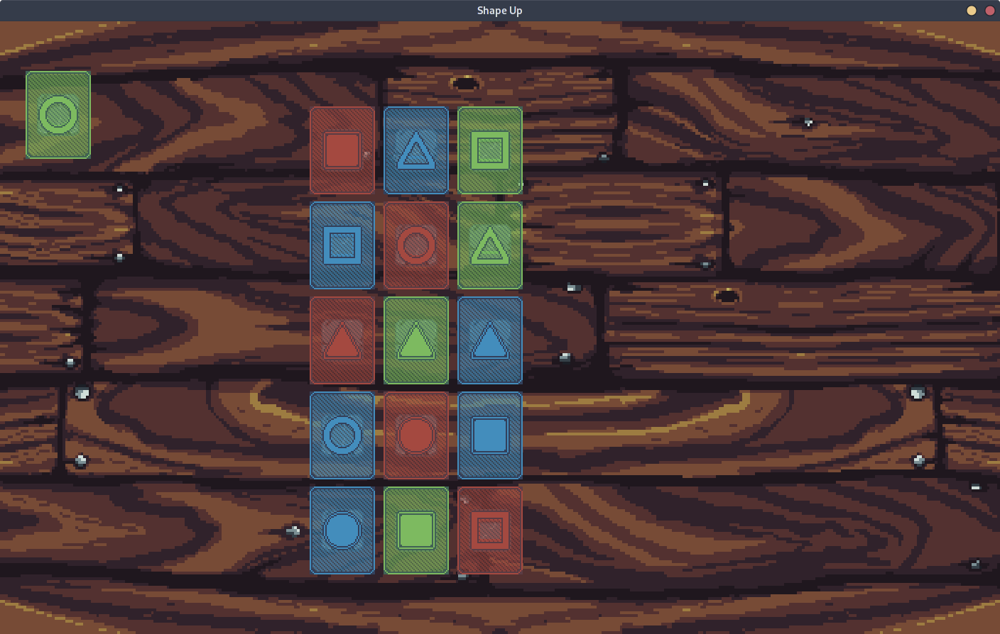
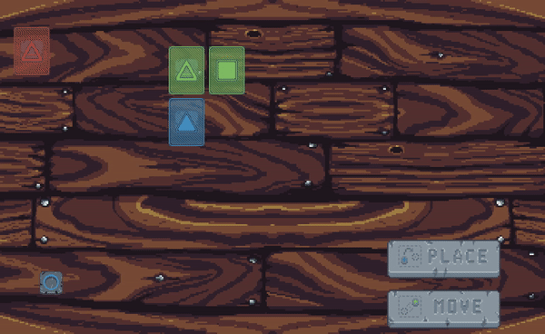
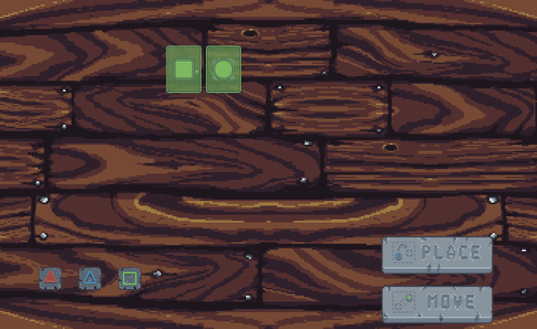
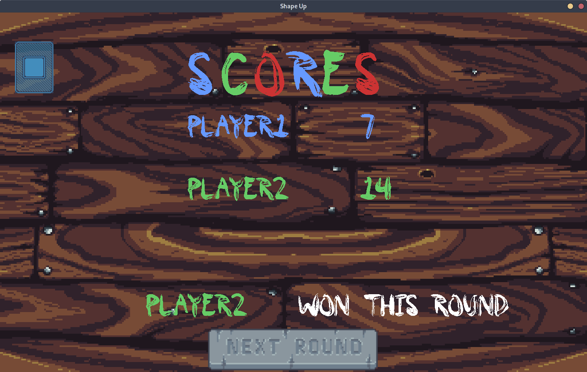

# Shape Up Game
<p align="center">
 
</p>

## Introduction

As part of a course at UTT, we had to program a game using OOP in Java. The game is called Shape Up and it is a board game using cards. The game can be played by 2 to 3 players.  The goal is to have the best score, calculating from the different alignments of cards which have the same characteristics.
A card has 3 characteristics: Shape, Color and Filling.  <br><br>



<br> <br>
The detailed rules can be found here: http://goodlittlegames.co.uk/games/06-shape-up.html  
As well as the subject, which is in French: https://moodle.utt.fr/pluginfile.php/22853/mod_resource/content/3/PROJET%20LO02.pdf 

To create the game, we decided to change the graphic charter in creating ourselves cards. To make this, we called upon a friend, Thomas Durand who is graphist to create the background, buttons and cards of the game. The idea was to represent stones which make an hologram appear when we put it on the table. So cards are represented by holograms, that’s why you can see it sizzle.
The game’s music was made by another friend, Marceau Canu, who is a music producer.

## Installation: 
Java 14+ is required in order to play the game, you can find it here: https://jdk.java.net/  
You can install the game by downloading the jar file here: https://github.com/JacquesMironneau/Shape-up-game/releases  

The game is then executable with a mere double click or via a terminal with the  
```$ java -jar ShapeUpGame.jar```  
If the game is launched via the desktop, only the HMI view will be displayed (the game will not be playable in terminal and hmi simultaneously).

## Repository organisation:  
.  
├── **doc/**: javadoc, diagrams and project report (fr)  
├── **res/**: project ressources (tiles, cards, holograms, music)  
├── **readme_res/**: readme ressources (screenshot, gifs)  
└── **src/**: java sources files  

## User informations
### Set up the game
To play this game, you have to first set up the game. There are several menu pages in order to set up the game. First you choose the game mode, you have 3 modes:
- Normal mode, which follows the official rules of Shape Up.
- Advanced mode, which follows the official rules of Shape Up.
- No Adjacency mode, which is a mode that we created, it’s just allowed to remove adjacency rules, then you can put a card on the board without checking if the card has another card adjacent.

Then you have to choose one way to calculate the score, you have 2 choices:
- Normal Calculator, which follows the official rules of ShapeUp.
- Bonus Calculator, which is a way to calculate the score we invented, it allows more points for big alignments.

Then you choose one shape of board, you have the choice between 3 shapes:
- Square, which is actually a rectangle, which follows the official rules of Shape Up.
- Triangle, which is an additional form we imagined.
- Circle, which is an additional form we imagined too.

<p align="center">
   
</p>


Then you have to set up players. You can choose 2 to 3 players. A player can be Virtual or Real. If you choose one real player, you just have to give him a name. If you choose one virtual player, you have to choose his difficulty between 2: Normal and Difficult.   
You can’t choose more than 3 players or less than 2.  
After this, you have finished setting up the game and you’re ready to play !  
<br><br>
### Play a turn
When you’re playing, you have two action’s choices: **Move** a card or **Place** a card.
- To place a card, you have to drag a card from your hand to available positions which appear when you click on the stone. 
- To move a card, it’s quite similar, you have to drag a card from the board to another available positions which appear when you move the stone.
<br>
<p align="center">
 
 <p>
<br><br>
When you want to finish your turn, after having placed a card, and moving or not a card, you just have to click on the button “End Turn”, then it’s time for the next player to play !  

At the end of the round, a score page appears and you see who won the round. A game is composed of 4 rounds.  

<p align="center">

</p>

## Technical implementation
For this project we have used the SWING library and implemented several design patterns.  

- We first use MVC pattern to separate the logic from the view of the application. Every user action is given to a controller which then changes the state of the model. Next, the model notifies the views (using the Observer pattern) that its state has changed. 
According to the specification, the game must be playable using terminal and GUI at the same time. Thus, the user can decide to start an action on its terminal and then move to the HMI. We have therefore made a custom scanner class which is interruptible (contrary to the Scanner class), our controller supports concurrency and allows the user to play with the chosen view.  

- For this project we have realized unit testing using the JUnit framework. Since our model quickly grows in complexity (with the addition of different boards, score calculator and game versions) we realized a robust test suite to cover the different game scenarios.  

- We also used the Visitor pattern to dissociate the score calculation from the board in itself. At the end of a turn, the calculator visits the board and then proceeds to the player score calculation.  

- The last pattern we used is the Strategy one. We used it to implement different strategies for the virtual players. A virtual player might use an easy or a hard strategy depending on the game set up.  

